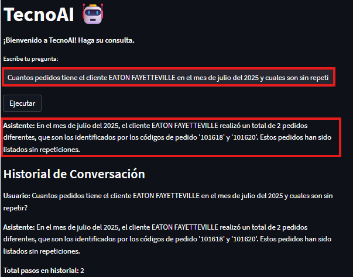
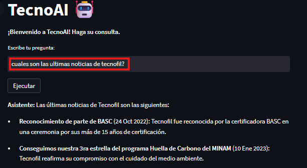
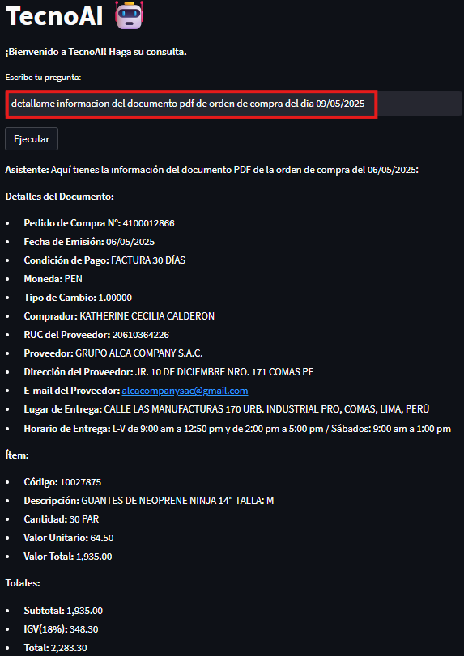
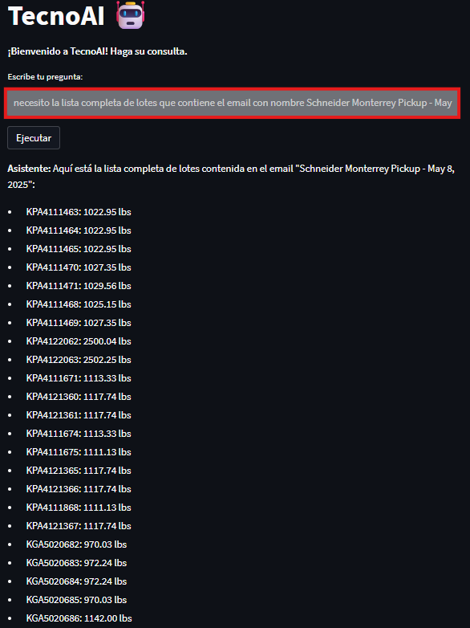
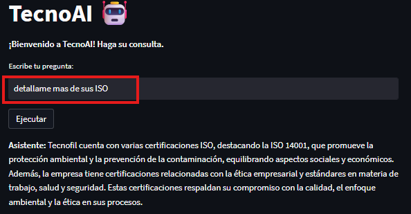
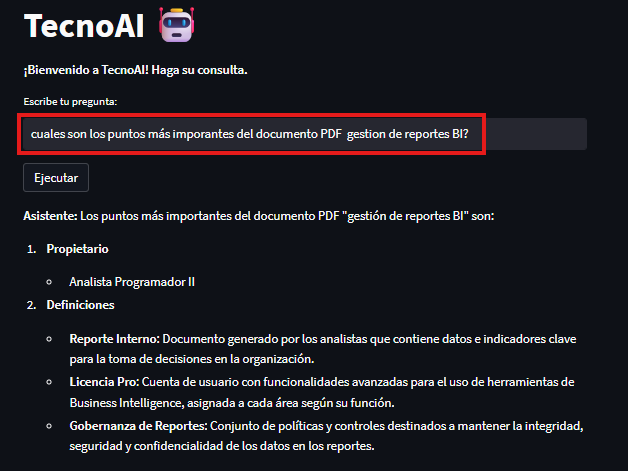

# Desarrollo de un Agente SQL sobre SAP Datasphere y Sistema de Recuperación Augmentada (RAG) para Consultas en Documentos, Correos y Sitio Web

## 1.	Problemática: 

En entornos empresariales, acceder a información detallada sobre pedidos, fechas críticas y sus cantidades (presupuesto, colocado, despachado, en producción y facturados) es un proceso fragmentado y algo que podría mejorarse. Aunque existen reportes en SAP HANA o BI corporativos que contienen tablas con la información completa, acceder a ellos implica múltiples pasos manuales y tiempos de espera significativos:

a)	Entrar al sistema SAP S/4HANA o SAP Datasphere.                                                                                                                                                
b)	Seleccionar la transacción correspondiente (por ejemplo, ZXXXXX).                                
c)	Esperar a que la ejecución del reporte termine—lo cual puede tardar minutos o incluso más, si la reporte es muy grande y tiene mucha lógica e integración de tablas en el código.                      
d)	Descargar la tabla o visualizarla en pantalla; a veces es necesario exportar a Excel para poder filtrar.                                    
e)	Abrir el archivo Excel, aplicar filtros para ubicar el pedido específico o agrupar pedidos por “memo”, y luego buscar manualmente fechas de despacho exactas o cantidades en cada etapa (colocados, despachados, en producción, facturados).

Por otro lado, se cuenta con información que no viene directamente de SAP, sino en documentos no estructurados (PDF de contratos, políticas internas), correos electrónicos (EML) con confirmaciones de proveedores o detalles de despacho, e incluso en páginas web de la intranet que contienen certificaciones y procedimientos que afectan ciertos pedidos. Sin unificación entre estas fuentes, surgen preguntas que el BI no cubre fácilmente, como:                                              

•	Fechas específicas de eventos: “¿En qué día exacto recibió el almacén la confirmación de despacho del pedido 67890?” (registrado en un correo).                    
•	Pedidos vinculados a un memo: “¿Qué pedidos pertenecen al memo X y cuáles de ellos están pendientes de facturar?”                                        
•	Últimos cambios de pedidos: “¿Cuáles fueron los 5 pedidos que se modificaron por última vez en mayo de 2025?” (información que podría no estar disponible directamente en el BI o que requiere extraer toda la tabla de cambios de pedidos).                                           

Estas consultas puntuales, que en un mundo ideal podrían resolverse con un par de clics en un BI, se traducen en: navegar en SAP, ejecutar transacciones, esperar resultados, exportar a Excel, filtrar manualmente y luego revisar correos o PDFs adicionales. El resultado es demoras de horas para obtener respuestas que deberían ser inmediatas.

### Contexto y actores involucrados:

•	Analistas de operaciones, logística y ventas: preparan reportes diarios y requieren datos agregados al instante.                                      
•	Gerentes y directores: validan presupuestos y supervisan KPIs de producción, despacho y facturación.                                       
•	Equipos de TI/BI: mantienen los reportes en SAP y dashboards en el BI.                                   
•	Usuarios de áreas internas (Compras, Calidad, RR. HH.): necesitan consultar políticas y procedimientos en PDF y la intranet de Tecnofil.                                        

### Limitaciones del enfoque tradicional
1.	Cuellos de botella en TI/BI: generación de reportes batch y acumulación de tickets retrasan la información.
2.	Falta de integración: combinar datos estructurados de SAP con contenidos no estructurados (PDF, EML, web) requiere trabajo manual intensivo.
3.	Esfuerzo y tiempo: las extracciones, exportaciones y agregaciones manuales consumen gran parte del día de los usuarios.

### Objetivo                                

Diseñar un agente híbrido que, mediante consultas SQL en tiempo real a la vista comercial de SAP HANA y un sistema RAG capaz de procesar PDF, EML y página web, permita a analistas y directivos obtener respuestas en lenguaje natural de forma inmediata y sin depender de intervenciones manuales.
Adicionalmente, el agente tiene la capacidad de generar gráficos automatizados en Python, por ejemplo, para mostrar evolución de pedidos, cumplimiento de despachos, o KPIs clave. Debido a las limitaciones del entorno de visualización en Streamlit, estas visualizaciones se guardan como imágenes en una carpeta local y pueden ser enviadas por correo electrónico como adjuntos, facilitando la distribución de reportes visuales a tomadores de decisiones.

## 2.	Solución:
Se implementa un agente híbrido que permite a los usuarios consultar información crítica de pedidos, clientes y documentos en lenguaje natural, combinando:
•	Consultas SQL en tiempo real sobre la vista comercial de SAP HANA (ventas, producción, despacho, facturación).
•	Recuperación aumentada (RAG) desde documentos no estructurados como PDFs (órdenes de compra, políticas), correos EML y páginas internas de la intranet.
Explicación del flujo conversacional
  1.	Usuario inicia la consulta
  •	Ej. “Quien es el ejecutivo comercial del pedido 100613?”
  
  2.	Detección de intención
  •	El sistema clasifica si requiere datos de la vista comercial (SQL) o búsqueda en documentos/web (RAG).
  3.	Ruta SQL (vista comercial)
  •	Traduce la parte estructurada de la consulta al dialecto SQL SAP HANA.
  •	Ejecuta SELECT … FROM vista_comercial WHERE Pedido = 100613.
  •	Formatea el resultado para integrarlo en la respuesta.
  4.	Ruta RAG (PDF, EML, web)
  •	Filtra por metadatos (tipo de documento, fecha, remitente).
  •	Recupera fragmentos relevantes (chunks) desde:
     - PDFs (órdenes de compra, políticas internas).                        
     - Correos EML (confirmaciones, fechas de entrega).                
     - Páginas web internas (procedimientos, certificaciones).                        
    
  5.	Fusión y respuesta
  •	Combina datos SQL y hallazgos RAG en un único mensaje.
  •	Entrega la respuesta en lenguaje natural, adjuntando:
  o	Valores clave (importe, fechas).
  o	Extractos de políticas y tablas.
  o	Enlaces o referencias a documentos y páginas.

  6.	Pruebas                                                                                                                                                                   
     
     
     
     
     
     
     

## 3. Arquitectura de solución

La solución está compuesta por un agente híbrido inteligente que direcciona las consultas del usuario hacia la ruta más adecuada: consulta estructurada en SAP HANA o recuperación aumentada (RAG) desde documentos no estructurados. A continuación, se describen los principales componentes:

🤖 Agente                                                        
•	Interfaz de entrada: el usuario realiza una pregunta en lenguaje natural desde una interfaz.                                   
•	Disparador de decisión: clasifica la consulta y dirige la ejecución hacia la herramienta SQL (estructura) o la herramienta RAG (no estructura).

🔧 Herramientas  

•	Herramienta SQL (SAP HANA):
o	Convierte la pregunta en una consulta SQL.
o	Se conecta a la base SAP HANA mediante un conector personalizado.
o	Responde en lenguaje natural al usuario.

•	Herramienta RAG:
o	Ingresa documentos desde distintas fuentes (PDF, EML, páginas web) mediante un loader.
o	Aplica chunking, dividiendo el contenido en fragmentos manejables.
o	Genera representaciones vectoriales usando un modelo de embeddings.
o	Almacena los vectores en una base vectorial (FAISS, Chroma, InMemoryVectorStore).
o	Filtra resultados con base en metadatos (tipo de documento, origen, fecha, remitente).
o	Utiliza HyDE (Hypothetical Document Embeddings) para enriquecer la recuperación generando documentos hipotéticos que mejoran los resultados del RAG.

• Herramienta Generador de gráficos (Python):
o	A partir de resultados estructurados (por ejemplo, KPIs o evolución de pedidos), se genera una visualización usando bibliotecas de Python como Matplotlib o Plotly.
o	Debido a limitaciones de visualización en tiempo real en Streamlit, los gráficos se guardan como archivos de imagen en una carpeta local.
o	Estas imágenes pueden ser incluidas como adjuntos en correos automáticos, permitiendo a usuarios clave recibir reportes visuales sin tener que acceder al sistema.

🔁 Pipeline RAG
1.	Ingesta → loader.
2.	Chunking → partición inteligente del texto.
3.	Embeddings → generación de vectores.
4.	Vector Store → almacenamiento y recuperación.
5.	HyDE (opcional) → generación adicional de chunks hipotéticos.
6.	Prompt template + contexto → se genera una respuesta precisa y contextualizada.

📦 Vector Store + Filtros
•	Almacena todos los vectores generados.
•	Mejora la precisión aplicando filtros por metadatos: tipo de archivo, cliente, fecha, etc.

 🧠 Memory Saver
•	Se usa un componente de memoria conversacional para mantener el contexto del usuario a lo largo de varias interacciones.

📤 Envío por correo (opcional)
•	Las respuestas pueden enviarse automáticamente en formato amigable utilizando GoogleToolkit, integrando visualización y formato claro por correo electrónico.

